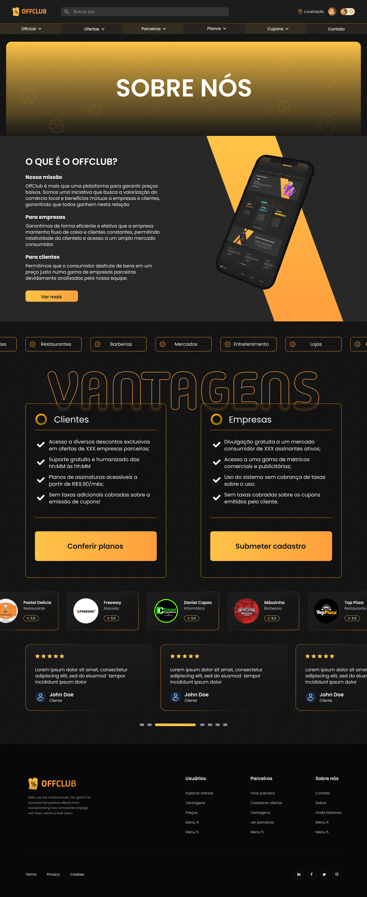

# Visualizar descrição do serviço

## Histórico de Revisões

| Data | Versão | Descrição | Autor |
| :--: | :----: | :-------: | :---: |
| 28/09/2025 | 1.0 | Versão inicial | Heitor Barboza |
| 02/11/2025 | 2.0 | Adequação e correção de datas | Heitor Barboza |
| 18/01/2026 | 3.0 | Inclusão de protótipos | Heitor Barboza |
| - | - | - | - |

## 1. Resumo

O cliente visitante pode visualizar a descrição do funcionamento, objetivo e vantagens do OffClub

## 2. Atores

- Principal: Visitante

## 3. Pré-condições

## 4. Pós-condições

## 5. Fluxos de Eventos

### 5.1 Fluxo Principal

| Ator | Sistema |
| :--: | :-----: |
| 0. O visitante clica em “Saiba Mais” na página inicial | - |
| - | 1. o sistema retorna uma página exibindo informações relevantes sobre o sistema a fim de convencê-lo a assinar. |

### 5.2 Fluxos de Exceção

## 5.3 Fluxos Alternativos

## 6. Protótipos de Interface

### Tela de saiba mais

