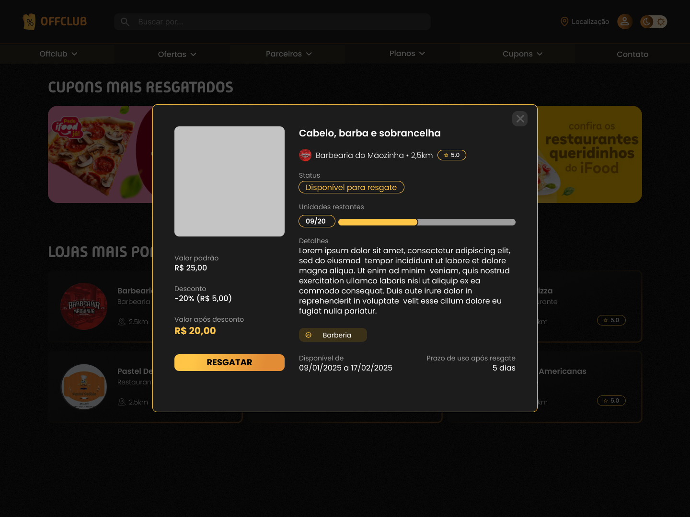
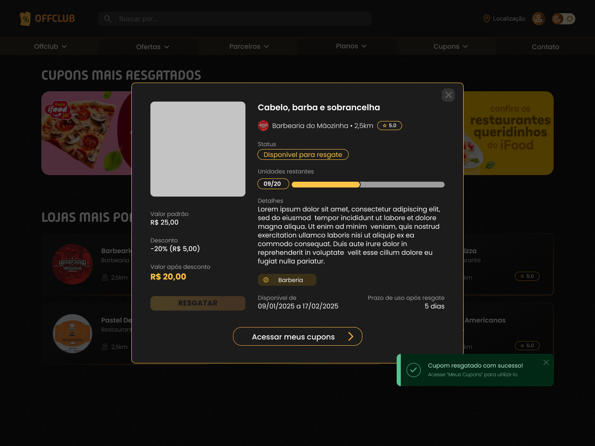

# Resgatar cupons

## Histórico de Revisões

| Data | Versão | Descrição | Autor |
| :--: | :----: | :-------: | :---: |
| 20/05/2025 | 1.0 | Versão inicial | Heitor Barboza |
| 08/07/2025 | 2.0 | Atualização para implementação | Amanda Lara |
| 28/09/2025 | 3.0 | Revisão para resolução de conflitos e atualização do código do CDU | Heitor Barboza |
| 02/11/2025 | 4.0 | Correção de datas | Heitor Barboza |
| 18/01/2026 | 5.0 | Inclusão de protótipos | Heitor Barboza |
| - | - | - | - |

## 1. Resumo

O usuário assinante gera cupons a partir de ofertas disponibilizadas para o seu plano de assinatura. 

## 2. Atores

- Principal: Assinante

## 3. Pré-condições

- Assinante devidamente cadastrado e com assinatura ativa
- Oferta(s) devidamente cadastrada(s) e ainda válida

## 4. Pós-condições

- Dados do cupom devidamente persistidos

## 5. Fluxos de Eventos

### 5.1 Fluxo Principal

| Ator | Sistema |
| --- | --- |
| 0.  Na página de ofertas, o assinante clica no card do cupom que deseja resgatar.  | - |
| - | 1.  O sistema abre um modal com os detalhes da oferta.  |
| 2. É clicado em “resgatar”.  | - |
| - | 3. É gerada uma mensagem de sucesso e aparece um botão para redirecionar o usuário para a página de “Meus Cupons” |

### 5.2 Fluxos de Exceção

#### 5.2.1 Oferta finalizada

| Ator | Sistema |
| --- | --- |
| - | 3.1 O sistema exibe uma mensagem indicando que o cupom está esgotado.  |
|  | (retorna ao passo 0) |

## 5.3 Fluxos Alternativos

### 5.3.1 Oferta fechada

| Ator | Sistema |
| :--: | :-----: |
| 2.1. o assinante fecha a oferta | - |
| - | (retorna ao passo 0) ||

## 6. Protótpos de Interface

### Tela de exibição das ofertas

### Tela de exibição de detalhes da oferta

### Tela de confirmação da emissão do cupom

