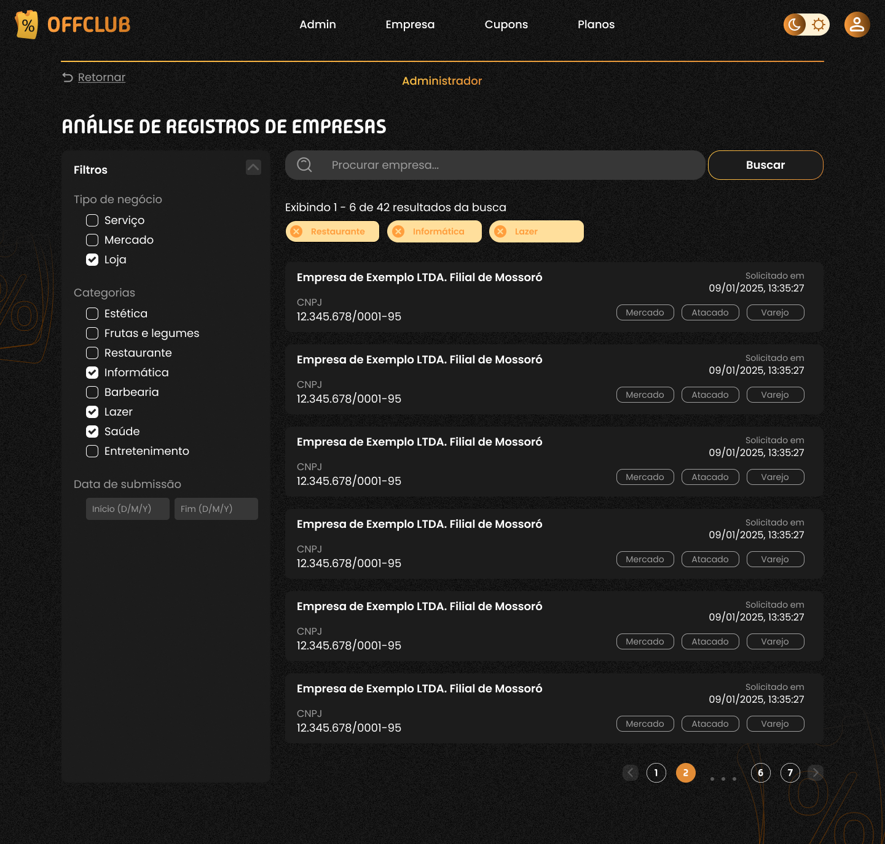
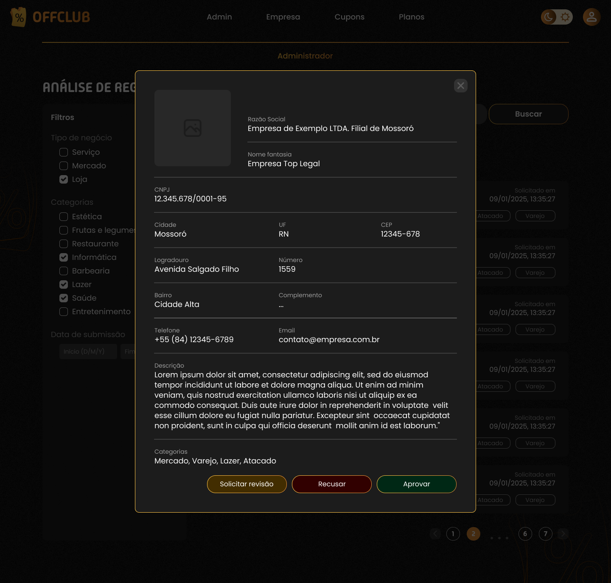

# Aprovar cadastro de empresa

## Histórico da Revisão 
|  Data  | Versão | Descrição | Autor |
| :--: | :----: | :-------: | :---: |
| 12/05 | 1.0 | Adição das seções de resumo, atores e condições  | Lucas Cássio |
| 28/09 | 2.0 | Revisão das seções de resumo, atores e condições e atualização do código do caso de uso  | Heitor Barboza |
| 02/11 | 3.0 | Adequação e correção de datas | Heitor Barboza |
| 18/01/2026 | 4.0 | Inclusão de protótipos | Heitor Barboza |
| - | - | - | - |

## 1. Resumo 
Caso uma empresa procure cadastrar-se em nosso sistema, o administrador ficará encarregado de aprovar ou recusar a efetivação desse cadastro.

## 2. Atores 
- Administrador

## 3. Pré-condições
- Empresa possuir um e-mail válido
- Empresa possuir CNPJ
- Empresa possuir razão social

## 4.Pós-condições
- Persistem-se os dados da empresa
- Ativa-se o usuário associado

## 5. Fluxos de evento

### 5.1. Fluxo Principal 
|  Ator  | Sistema |
|:-------|:------- |
|1. O administrador clica no botão que o faz acessar as requisições de cadastro pelas empresas.| --- |
| --- |2. O sistema direciona o administrador para a página solicitada exibindo a tabela com as solicitações| --- |
| 3.  O administrador clica em uma linha da tabela, que representa a empresa.| --- |
| --- |4. O sistema exibe dados detalhados da solicitação de cadastro submetida pela empresa| --- |
| 5. O administrador lê as informações da empresa e aprova ou desaprova seu cadastro por meio dos botões "Aceitar/Recusar".| --- |

## 6. Protótipos de Interfaces

### Tela com tabela de solicitações

### Tela de detalhes da solicitação

