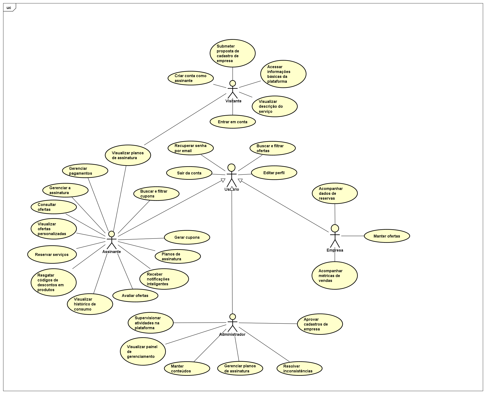

# Modelo de Casos de Uso

## 1. Diagrama de Casos de Uso

## 2. Listagem dos detalhamentos dos casos de uso

1. [CDU-001 - Criar conta como assinante](detalhamentos/cdu_001.md)
3. [CDU-003 - Reservar serviço](detalhamentos/cdu_002.md)
2. [CDU-002 - Gerar cupom](detalhamentos/cdu_003.md)
3. [CDU-004 - Aprovar cadastro de empresa](detalhamentos/cdu_004.md)
