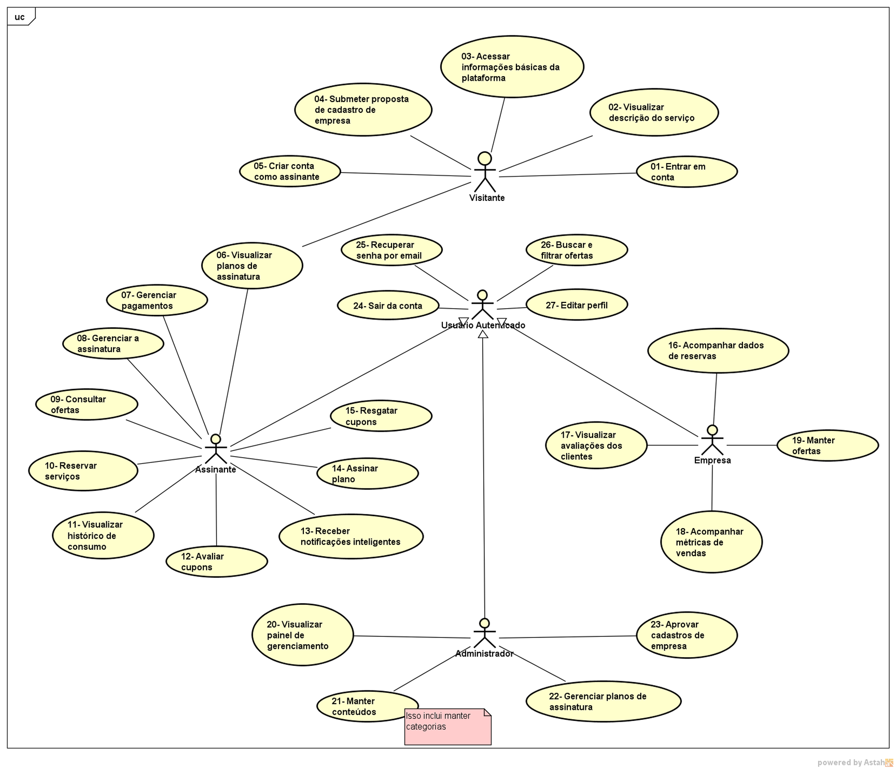

# Modelo de Casos de Uso

## Histórico de Revisões

|  Data  | Versão | Descrição | Autor |
|:-------|:-------|:----------|:------|
| 16/05/2025 | **1.00** | Versão Inicial  | Fellipe Aleixo |
| 26/05/2025 | **2.00** | Versão com detalhamentos iniciais | Amanda Lara, Clara Teodósio, Heitor Barboza e Lucas Cássio  |
| 30/06/2025 | **3.00** | Atualização da imagem do diagrama de casos de uso  | Heitor Barboza e Lucas Cássio |
| - | - | - | - |

## 1. Diagrama de Casos de Uso

## 2. Listagem dos detalhamentos dos casos de uso

1. [CDU-001 - Criar conta como assinante](detalhamentos/cdu_001.md)
3. [CDU-003 - Reservar serviço](detalhamentos/cdu_002.md)
2. [CDU-002 - Gerar cupom](detalhamentos/cdu_003.md)
3. [CDU-004 - Aprovar cadastro de empresa](detalhamentos/cdu_004.md)
